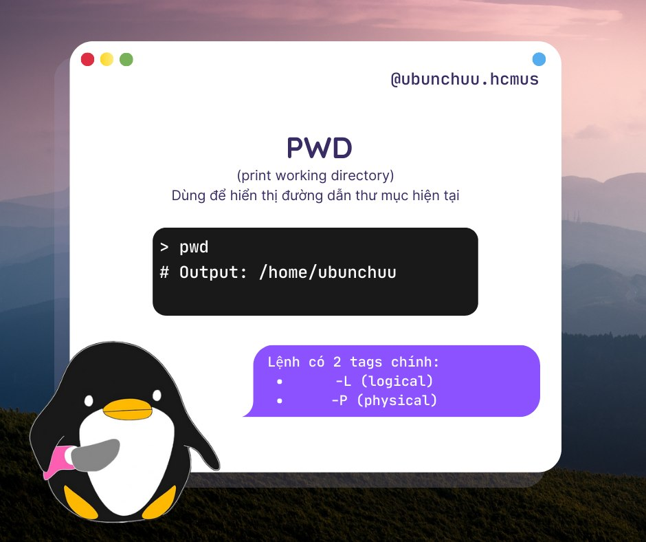
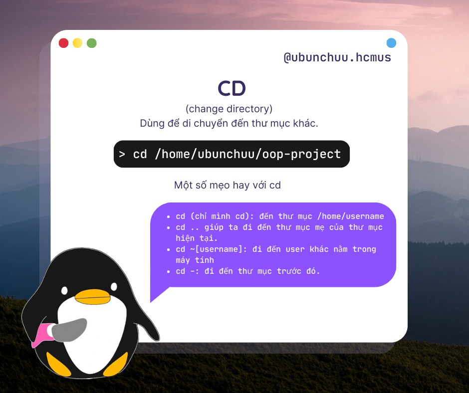
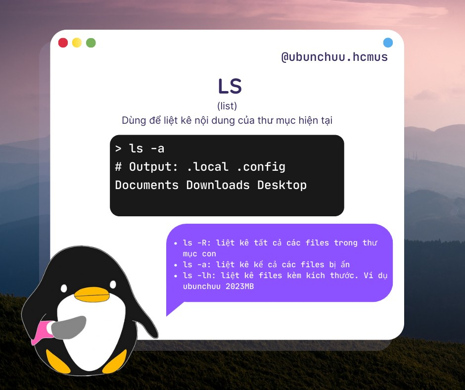
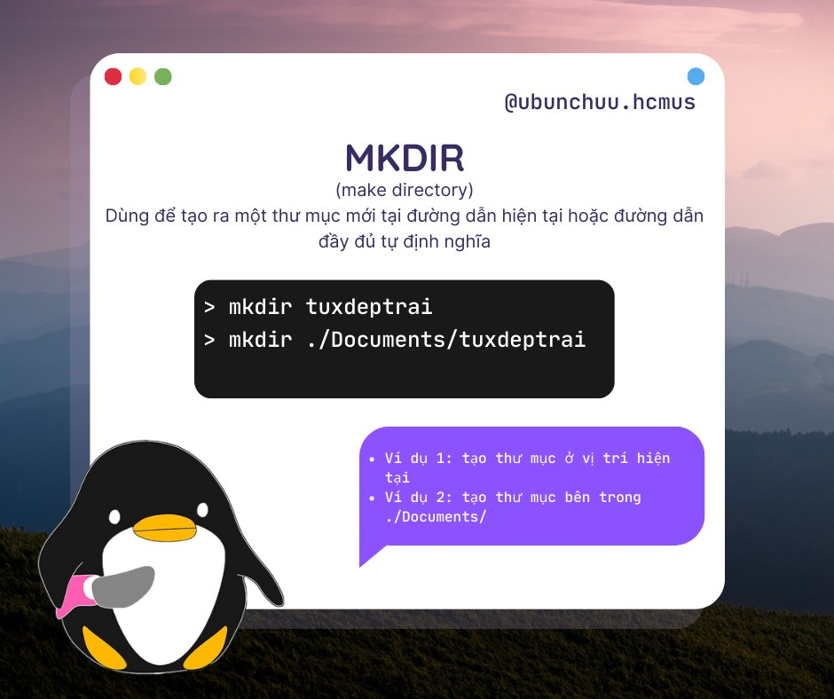
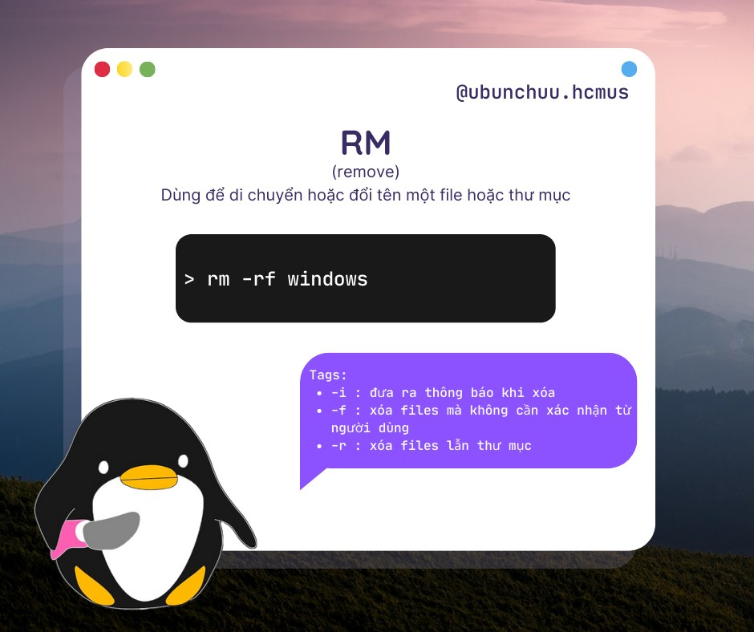
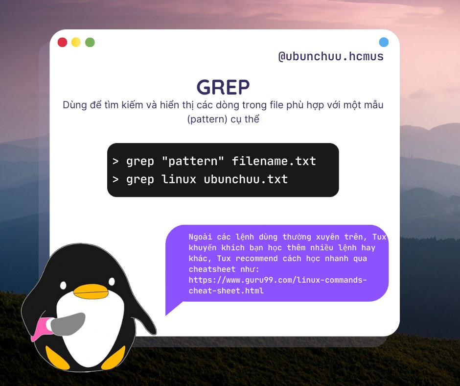

Để làm việc với file trên Linux (hay trên Linux server), các bạn không thể sử dụng các thao tác bằng đồ họa (kéo thả như trên Windows) mà phải thao tác qua cửa sổ dòng lệnh (command-line). Điều này gây khó khăn cho những người không quen thuộc với việc sử dụng console.

Thông qua bài viết này, Tux sẽ giúp mọi người làm quen với một số lệnh cơ bản để quản lý file trên hệ thống Linux. Chúng ta sẽ bắt đầu với các lệnh này cơ bản, đơn giản và dễ nhớ, giúp cho việc quản lý file trên Linux trở nên dễ dàng hơn.

> :bulb: Hãy nhớ nút mở Terminal mặc định trên Linux là Ctrl+Alt+T nhé!


## Các lệnh cơ bản

Dưới đây là một số lệnh cơ bản để quản lý file trên Linux:
Các lệnh đều tuần theo syntax như sau: [command] [option] (option là các tags)

### 1. `pwd`



Lệnh `pwd` (print working directory) dùng để hiển thị đường dẫn thư mục hiện tại. Mặc định khi chưa thực hiện thao tác *"đổi thư mục"* thì khi chúng ta mới mở Terminal lên, chúng ta sẽ đang ở thư mục **/home/username**.
Lệnh có 2 tags chính: -L (Logical), -P (Physical)

**Ví dụ:**

```bash
pwd #Output: /home/ubunchuu nếu username là ubunchuu
```

### 2. `cd`



Lệnh `cd` (change directory) dùng để di chuyển đến thư mục khác.

**Ví dụ:**

```bash
cd /home/ubunchuu/oop-project
```
> Lúc này khi lệnh cd đã được thực thi, chúng ta sẽ có output của lệnh `pwd` bên trên là: `/home/ubunchuu/oop-project`

Mẹo riêng dành cho lệnh `cd`:
- `cd`: gõ chỉ mình lệnh `cd` giúp ta chuyển nhanh đến thư mục `/home/username` hiện tại mà không cần phải ghi địa chỉ ra.
- `cd ..`: giúp ta đi đến thư mục mẹ của thư mục hiện tại.
- `cd ~[username]`: giúp ta đi đến user khác nằm trong máy tính Linux.
- `cd -`: đi đến thư mục trước đó.

### 3. `ls`



Lệnh `ls` (list) dùng để liệt kê nội dung của thư mục hiện tại.
Các tags của lệnh list:
- `ls -R`: liệt kê tất cả files bên trong mọi thư mục con.
- `ls -a`: hiện ra tất cả files kể cả files đang bị ẩn (hidden).
- `ls -lh`: hiên ra files kèm kích thước của files ví dụ như `ubunchuu 2022MB`.

**Ví dụ:**

```bash
ls -a #list ra tất cả file, kể cả file ẩn trong thư mục hiện tại
```

### 4. `touch`


Lệnh `touch` dùng để tạo ra một file mới tại thư mục hiện tại hoặc theo đường dẫn của file.

**Ví dụ:**

```bash
touch /home/ubunchuu/document/penguin.cpp # tạo file vào đường dẫn này
touch penguin.cpp # tạo file tại thư mục đang cd vào
```

### 5. `mkdir`



Lệnh `mkdir` (make directory) dùng để tạo ra một thư mục mới tại đường dẫn hiện tại hoặc đường dẫn đầy đủ tự định nghĩa.

**Ví dụ:**

```bash
mkdir ubunchuu-vip #tạo thư mục tên ubunchuu bên trong thư mục hiện tại
mkdir /home/ubunchuu/document/ubunchuu-vip #tạo thư mục tên ubunchuu bên trong thư mục hiện tại
```

### 6. `cat`


Lệnh `cat` dùng để hiển thị nội dung của một file.
Một số mẹo hay với lệnh cat:
- `cat > filename.txt `: in nội dung của file này vào 1 file mới.
- `cat filename1.txt filename2.txt > filename3.txt`: lấy ra output của `filename1.txt` và `filename2.txt`, nối chúng lại rồi đưa vào một file mới là `filename3.txt`.
- `tac filename.txt`: in nội dung file này theo thứ tự ngược lại.

**Ví dụ:**

```bash
cat cautrucdulieu.txt # In output bên trong file trên Terminal
```

### 7. `cp`


Lệnh `cp` (copy) dùng để sao chép một file hoặc một thư mục tới một địa chỉ.
Một số cách dùng với lệnh `cp`:
- `cp *.py /python`: copy tất cả file có đuôi .py vào thư mục python
- `cp filename1.txt filename2.txt /stored`: lưu nhiều files vào 1 địa chỉ, điều kiện là các files phải ở trong cùng thư mục đang `cd` vào.
- `cp -R /ubunchuu /best-website-to-learn-linux`: tag `-R` giúp ta copy được cả một thư mục vào một địa chỉ xác định.

**Ví dụ:**

```bash
cp hoclinux.txt mybrain/
```

### 8. `mv`


Lệnh `mv` (move) dùng để di chuyển hoặc đổi tên một file hoặc thư mục.
Các cách dùng lệnh mv:
- `mv filename.txt /home/username/Documents`: di chuyển file đến địa chỉ thư mục.
- `mv old_filename.txt new_filename.txt`: đổi tên một file sang tên khác.

**Ví dụ:**
```bash
mv old-ubunchuu.cpp new-ubunchuu.cpp
```

### 9. `rm`



Lệnh `rm` (remove) dùng để xóa một file hoặc thư mục.
Các tags của lệnh `rm`:
* `-i` : đưa ra thông báo khi xóa.
* `-f` : xóa files mà không cần xác nhận từ người dùng.
* `-r` : xóa files lẫn thư mục.
> Ta cũng có thể sử dụng kết hợp các tags với nhau như : `-rf`

**Ví dụ:**

```bash
rm -rf windows # xóa tất cả file và thư mục con của thư mục windows
```

### 10. `grep`



Lệnh `grep` dùng để tìm kiếm và hiển thị các dòng trong file phù hợp với một mẫu (pattern) cụ thể.

**Ví dụ:**

```bash
grep "pattern" filename.txt
grep linux ubunchuu.txt # hiển thị ra những dòng có linux trong file.
```

> Ngoài các lệnh dùng thường xuyên trên, Ubunchuu khuyến khích các bạn nên học thêm nhiều lệnh hay khác, Ubunchuu recommend cách học nhanh qua cheatsheet như: https://www.guru99.com/linux-commands-cheat-sheet.html


## Bài tập luyện tập: Ngày 1


Học phải đi đôi với hành, Ubunchuu cung cấp cho các bạn một bài tập điều khiển thao tác với files và thư mục (làm quen với Terminal) của Ngày 1 trong hệ thống bài học "15 Days Flying With Tux" như sau:

**Bài tập sử dụng các lệnh điều khiển Linux**

*Hãy thực hiện các tác vụ sau đây bằng cách sử dụng các lệnh điều khiển Linux đã học:*

1. Tạo một thư mục có tên là **"linux_learning"**.
1. Di chuyển vào thư mục **"linux_learning"**.
1. Tạo một file có tên là **"my_file.txt"** trong thư mục **"linux_learning"**.
1. Mở trình soạn thảo văn bản lên, nhập **"hello world"**, lưu và đóng nó lại.
1. Hiển thị các files có trong thư mục **"linux_learning"**.
1. Sao chép file **"my_file.txt"** vào một thư mục khác có tên là **"backup"**.
1. Đổi tên file **"my_file.txt"** thành **"new_file.txt"**.
1. Di chuyển vào thư mục **"backup"**.
1. Xóa thư mục **"linux_learning"** và tất cả nội dung bên trong.
1. Tìm kiếm các dòng trong file **"new_file.txt"** chứa từ **"hello"** và hiển thị kết quả.

Hãy take note lại các lệnh bạn sử dụng để thực hiện từng tác vụ trên và kết quả sau khi thực hiện vào ứng dụng take note (ví dụ: Notion) của các bạn nhé. 

